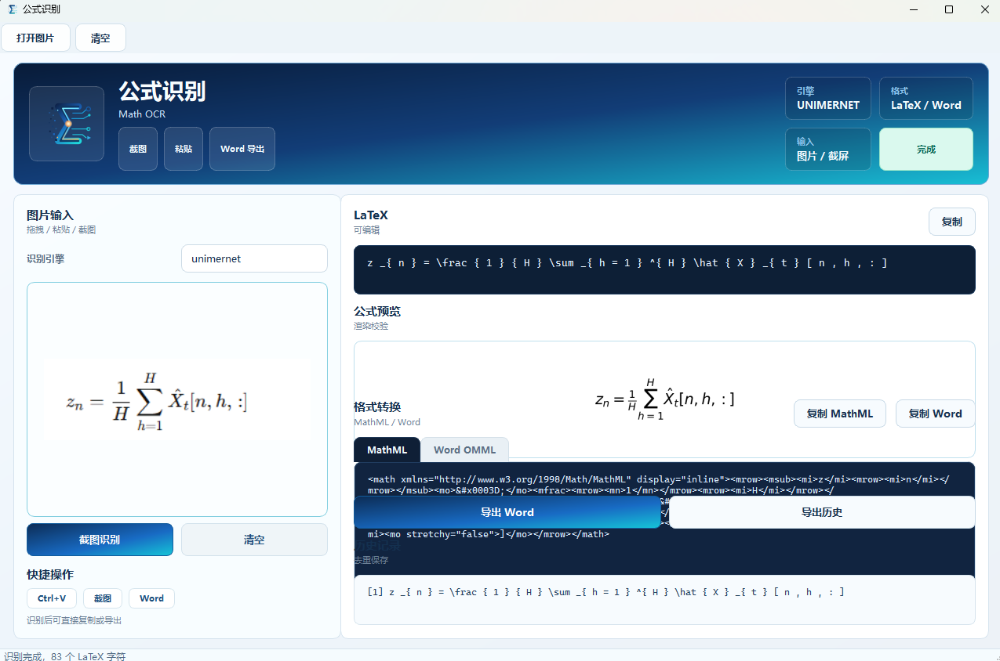

# 公式识别 / Math OCR

基于深度学习的数学公式 OCR 桌面应用，支持截图、拖拽、粘贴等多种输入方式，识别后一键导出 LaTeX / MathML / Word 公式。



## 功能特性

- **双引擎识别** — UniMERNet（默认）/ Pix2Tex，可实时切换
- **多种输入方式** — 截图选取、拖拽图片、剪贴板粘贴（Ctrl+V）、打开文件
- **实时公式预览** — 识别后即时渲染 LaTeX 公式预览
- **多格式输出** — LaTeX、MathML、Word OMML（原生可编辑公式）
- **Word 导出** — 单条 / 批量导出为 .docx，公式在 Word 中可直接编辑
- **历史记录** — 自动去重保存识别记录，支持批量导出

## 快速开始

### 1. 克隆仓库

```bash
git clone https://github.com/hongchengjin2-alt/formula-ocr.git
cd formula-ocr
```

### 2. 下载模型文件

模型文件 `unimernet_tiny.pth` 未包含在仓库中（约 411MB），需手动下载并放置到指定目录：

```bash
# 创建模型目录
mkdir -p models/unimernet_tiny

# 方式一：从 HuggingFace 下载（推荐）
pip install huggingface_hub
huggingface-cli download opendatalab/UniMERNet unimernet_tiny.pth --local-dir models/unimernet_tiny

# 方式二：使用 wget 直接下载
wget -O models/unimernet_tiny/unimernet_tiny.pth \
  "https://huggingface.co/opendatalab/UniMERNet/resolve/main/unimernet_tiny.pth"
```

下载完成后，确认文件路径为：
```
formula-ocr/
└── models/
    └── unimernet_tiny/
        └── unimernet_tiny.pth   ← 模型文件
```

### 3. 安装依赖

```bash
pip install -r requirements.txt
```

> 如需使用 UniMERNet 引擎的完整功能，还需额外安装：
> ```bash
> pip install unimernet[full]
> ```

### 4. 运行应用

```bash
python main.py
```

## 使用方法

| 操作 | 说明 |
|------|------|
| **截图识别** | 点击「截图识别」按钮，框选屏幕上的公式区域 |
| **粘贴图片** | 复制图片后按 `Ctrl+V` 粘贴 |
| **拖拽图片** | 将图片文件直接拖入左侧区域 |
| **打开文件** | 工具栏点击「打开图片」选择本地文件 |
| **切换引擎** | 左侧下拉框切换 UniMERNet / Pix2Tex |
| **复制结果** | 点击「复制」按钮复制 LaTeX / MathML / Word OMML |
| **导出 Word** | 点击「导出 Word」保存为 .docx（公式可编辑） |

## 项目结构

```
formula-ocr/
├── main.py                  # 应用入口
├── requirements.txt         # Python 依赖
├── validate.py              # 功能验证脚本
├── build_exe.ps1            # PyInstaller 打包脚本
├── core/
│   ├── recognizer.py        # OCR 引擎抽象层（UniMERNet / Pix2Tex）
│   ├── converter.py         # LaTeX → MathML / OMML 转换 + 公式渲染
│   └── paths.py             # 路径工具
├── ui/
│   ├── main_window.py       # 主窗口 UI
│   ├── image_drop_label.py  # 图片拖拽组件
│   ├── screenshot_selector.py # 截图选区组件
│   ├── theme.py             # 全局样式
│   └── workers.py           # 异步识别线程
├── configs/
│   └── unimernet_tiny.yaml  # UniMERNet 模型配置
├── models/
│   └── unimernet_tiny/      # 模型权重（需手动下载）
├── assets/
│   ├── math_ocr_logo.svg    # 应用图标
│   └── MML2OMML.XSL         # Microsoft MathML→OMML 转换表
└── hooks/
    └── rthook_dll_paths.py  # PyInstaller 运行时钩子
```

## 构建可执行文件

使用 PyInstaller 打包为独立 exe：

```powershell
.\build_exe.ps1
```

打包产物位于 `dist\公式识别\` 目录，双击 `公式识别.exe` 即可运行。

> 请保留整个文件夹，不要单独拷贝 exe，`_internal` 目录包含运行时依赖。

## 验证

运行功能验证脚本确认核心模块正常：

```bash
# 基础验证（转换、渲染、格式化）
python validate.py

# 带 OCR 引擎的完整验证
python validate.py --image path/to/formula.png --engine unimernet
```

## 系统要求

- Python 3.10+
- Windows 10/11（截图功能依赖系统 API）
- 推荐 8GB+ 内存
- 可选：NVIDIA GPU + CUDA（加速推理）

## 许可证

MIT License
